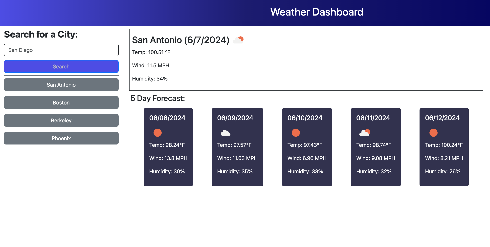

# Weather-Dashboard

## Description

This Weather Dashboard provides a user with a quick way to search and check the weather in any city, at any time, and receive the current weather, as well as a five-day forecast for the searched city.  This application will also save the cities after they've been searched in an interactive list on the left side of the screen, and the user can simply click to revist the weather conditions and forecast for any city they've previously searched.  

This project had learnings in the form of building comfortability using server-side APIs as well as understanding time and how it can skew results.  I was having issues trying to over-complicate the time results and ended up digging myself deep into a time-zone hole, trying to adjust for the UTC time zones as well as the standard applied local time zone, and go off that to adjust for results around the world.  Even then, it would appear that my midday results would yield middle of the night temperatures, so I had to take a different route by searching for the first instance of a midday result and search for that result for each of days in the five day forecast in order to collect the most useful data for a user: middle of the day anticipated temperatures.   

## Installation
N/A

## Usage

Upon loading the application, the user is presented with a blank page titled Weather Dashboard with a Search for a City text input field.  A user can type in whatever city they would like to check the weather conditions of, and upon hitting submit, a box will appear to the right of the search field with the city's name, the current date, an icon representing the current weather conditions, as well as current conditions for temperature in farenheight, wind by miles per hour, and the humidity percentage.  Below that, the user will be able to see a 5 Day Forecast for the searched city rendered on cards with all of the same weather statistics, including the date for the forecast. As soon as a city is searched it's added to a list on the left hand side of the screen where the user can click on previously searched cities and see the current weather and forecast for that city.  The page is responsive to use on smaller screens with the row of forecast cards wrapping to adapt to the smaller size and the columns using bootstrap classes adjusting as well to accomodate.  

Click [here](https://lindsay-terry.github.io/weather-dashboard/) to view the deployed application. 

## Credits
Resources used: 

* [Bootstrap Library](https://getbootstrap.com/)

* [OpenWeather API](https://openweathermap.org/)

* [Day.js](https://day.js.org/en/)

## License
N/A